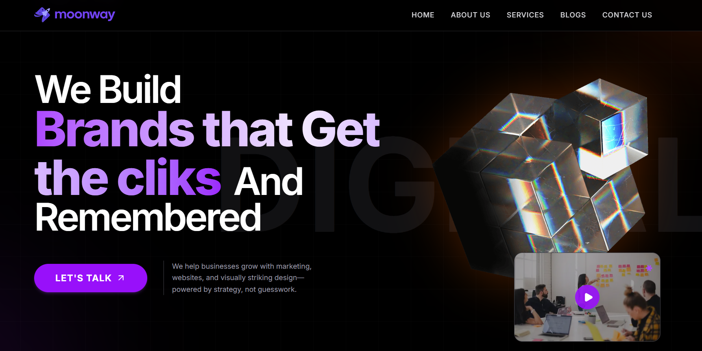

## 🌙Moonway

Moonway is a modern, responsive, and accessible Next.js template for building landing pages and marketing websites. It is built with the latest version of Next.js and includes a variety of features and components to help you create a professional and engaging website.

[Moonway - live demo](https://moonway-agency.vercel.app)

## Tech Stack

- Next.js
- Tailwind CSS
- Framer Motion
- lucide-react icons

## Preview

## Getting Started

First, run the development server:

``` 
npm install
``` 
```bash
npm run dev
# or
yarn dev
# or
pnpm dev
# or
bun dev
```

Open [http://localhost:3000](http://localhost:3000) with your browser to see the result.

You can start editing the page by modifying `app/page.tsx`. The page auto-updates as you edit the file.

This project uses [`next/font`](https://nextjs.org/docs/app/building-your-application/optimizing/fonts) to automatically optimize and load [Geist](https://vercel.com/font), a new font family for Vercel.

## Learn More

To learn more about Next.js, take a look at the following resources:

- [Next.js Documentation](https://nextjs.org/docs) - learn about Next.js features and API.
- [Learn Next.js](https://nextjs.org/learn) - an interactive Next.js tutorial.

You can check out [the Next.js GitHub repository](https://github.com/vercel/next.js) - your feedback and contributions are welcome!
